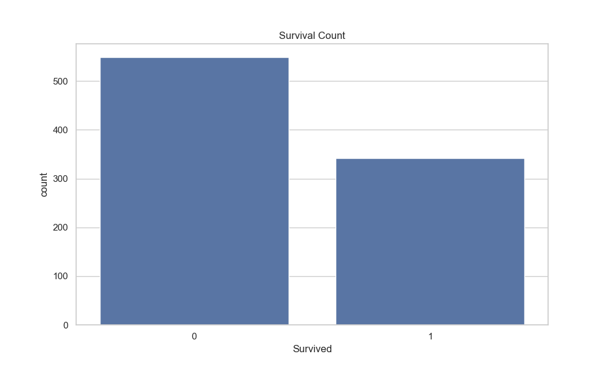
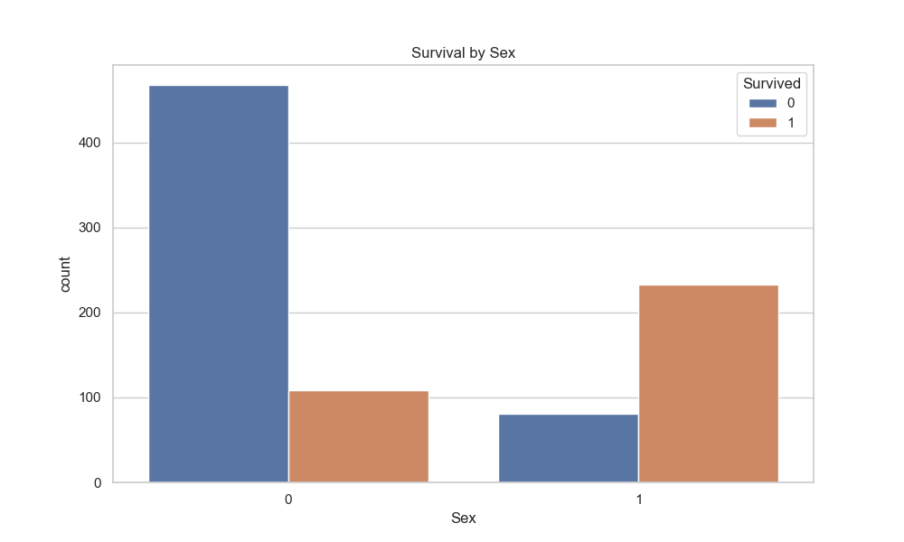
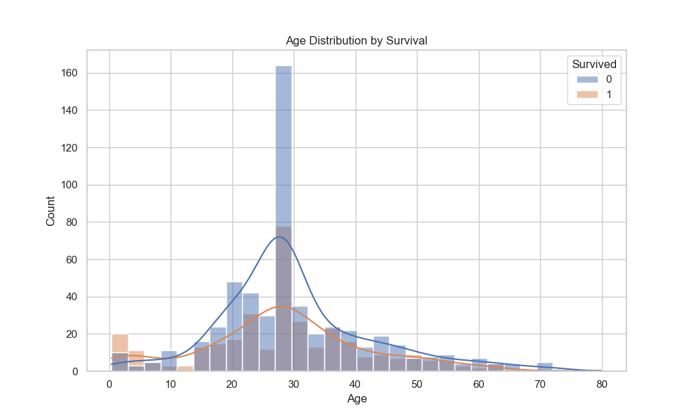
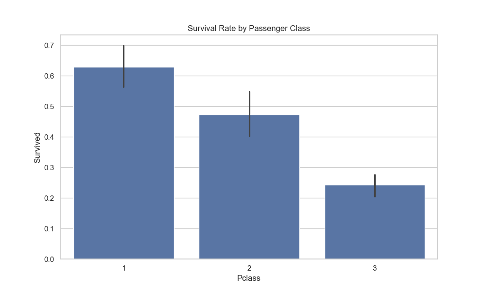
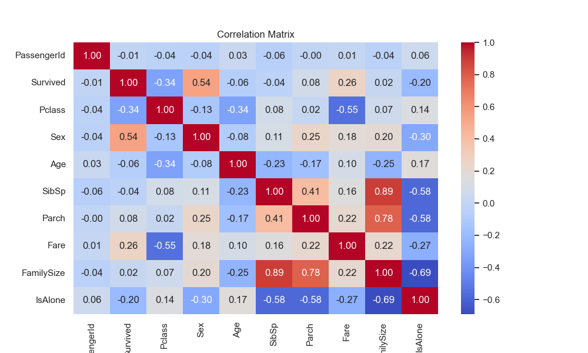
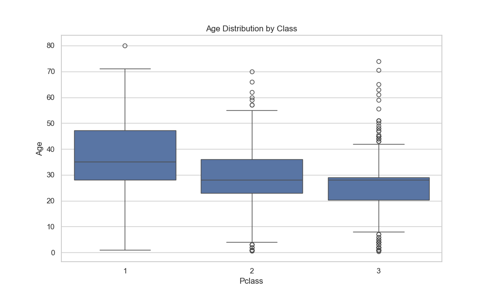
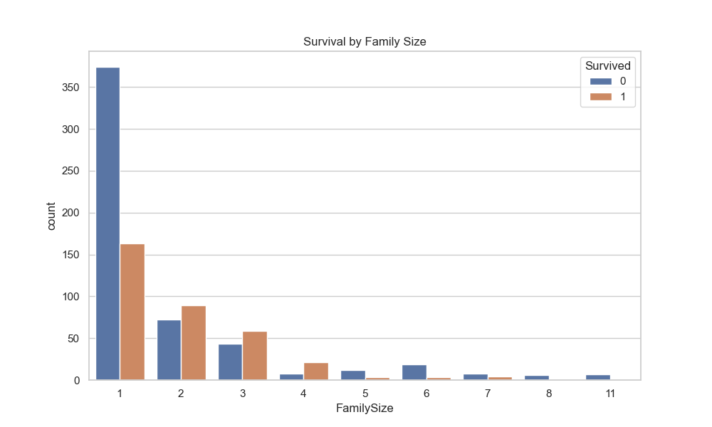

# **PRODIGY_DS_02 - Titanic Dataset EDA & Data Cleaning**

## 📌 Task Overview

This repository contains my second task as a **Data Science Intern** at **Prodigy InfoTech**.

**Task**:  
Perform **data cleaning** and **exploratory data analysis (EDA)** on a dataset of your choice. I selected the classic **Titanic dataset** from Kaggle.

**Dataset Source**:  
[Titanic - Machine Learning from Disaster (Kaggle)](https://www.kaggle.com/c/titanic/data)

---

## 🧠 Project Description

The objective of this task was to gain insights into the Titanic dataset by performing data preprocessing and visualization. The process involved:

- Cleaning missing and irrelevant data  
- Engineering useful features  
- Visualizing patterns and trends  
- Understanding relationships between survival and other variables  

---

## 🛠️ Tools & Technologies

- **Python**
- **Pandas** for data preprocessing
- **Matplotlib** & **Seaborn** for data visualization
- **Jupyter Notebook** / Python Script

---

## 🔍 Steps Performed

1. **Data Loading & Exploration**
2. **Missing Value Handling**:
   - Filled missing ages using median
   - Dropped 'Cabin' and 'Ticket' due to excessive missing/irrelevant data
   - Handled 'Embarked' missing values with mode
3. **Feature Engineering**:
   - `FamilySize` and `IsAlone` derived from `SibSp` and `Parch`
   - Label encoding for `Sex`
   - One-hot encoding for `Embarked`
4. **Visualization & EDA**:
   - Survival distribution
   - Age and gender impact on survival
   - Passenger class vs survival rate
   - Heatmap of correlations

---

## 📈 Output Visualizations

Here are the generated visual outputs from the analysis:

- 
- 
- 
- 
- 
- 
- 

---

## 📚 Key Learnings

- Learned how to clean real-world data and handle missing values effectively
- Understood how to use feature engineering to improve data insights
- Applied visualization tools to discover trends and relationships
- Explored how factors like gender, age, class, and family size influenced survival chances

---

## ✅ Conclusion

This project provided foundational hands-on experience with cleaning messy data and performing insightful EDA. It served as a strong introduction to data science workflows and storytelling with data.
